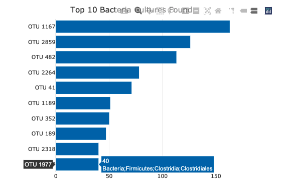
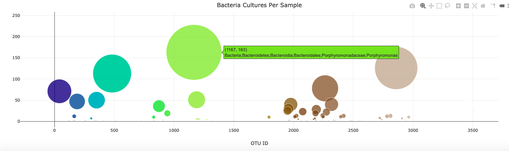
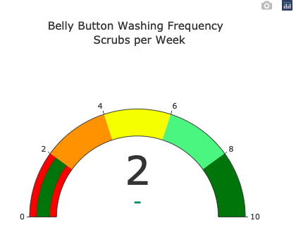

# Belly_Button_Biodiversity

Roza has a partially completed dashboard that she needs to finish. She has a completed panel for demographic information and now needs to visualize the bacterial data for each volunteer. Specifically, her volunteers should be able to identify the top 10 bacterial species in their belly buttons. That way, if Improbable Beef identifies a species as a candidate to manufacture synthetic beef, Roza's volunteers will be able to identify whether that species is found in their navel.

Deliverable 1: Create a Horizontal Bar Chart

Deliverable 2: Create a Bubble Chart

Deliverable 3: Create a Gauge Chart

Deliverable 4: Customize the Dashboard
    
    

